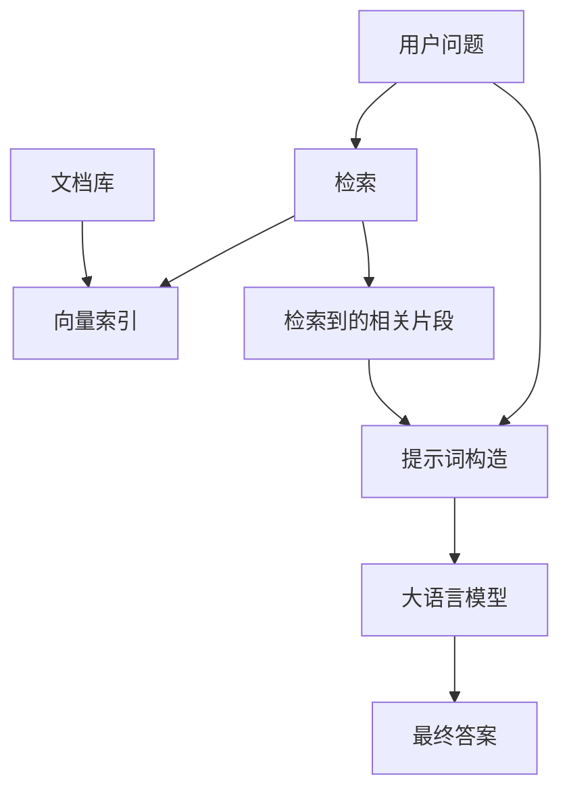

---
Company:
  name: BOEING
  logo: ./assets/boeing-logo.png
Document:
  Title: RAG 从零开始：概念、原理与实现
  Font:
    48: "#982828"
    36: "#005566"
    24: "#6d6d7d"
    16: "#9119ba"
  docCode: DOC0227703
  docRev: 1.0
  First Made Date: 5/22/2024
  First Made By (Author): 二大爷
output: pptx
---

# RAG 从零开始：概念、原理与实现

{traansparency:50,size:100*400,}
{traansparency:50,size:1600*900,}

## RAG 是什么


RAG（Retrieval-Augmented Generation，检索增强生成）是一种结合**信息检索**与**大语言模型生成**的技术，旨在解决大模型常见的“幻觉”、知识滞后、无法引用外部来源等问题。简单说：**先根据用户问题去知识库中搜索相关文档片段，再把这些片段连同问题一起交给大模型生成答案**。

下面我们从零开始，一步步理解 RAG 的原理、流程以及如何动手实现一个最简单的 RAG 系统。

## 为什么需要 RAG？

### 大语言模型不足

- **知识截止日期**：训练后知识就不再更新，无法回答新出现的事件或数据。
- **幻觉**：对未知问题会编造看似合理但错误的答案。
- **不可溯源**：用户不知道答案从哪来，难以验证可信度。

### 传统和现在做法对比

- 传统做法是重新训练或微调模型来加入新知识
  - 但成本高
  - 周期长
- RAG 提供了一种**低成本、动态更新、可溯源**的解决方案
  - 不需要改变模型参数
  - 在推理时临时从外部知识库检索相关信息即可

## RAG 的核心流程

### 典型的 RAG 分为

- **索引（Indexing）**
- **检索（Retrieval）**
- **生成（Generation）**

### 流程图



## 索引阶段

### 文档切分

- 将原始文档（PDF、网页、数据库记录等）按一定粒度（如段落、句子或固定 Token 数）切分成若干文本块（chunks）。

### 向量化

- 使用嵌入模型（embedding model
- 如 text-embedding-ada-002、bge-large）
- 将每个文本块转换成固定维度的向量（即其语义表示）。

### 建立索引

- 将所有向量存储到向量数据库
- （如 FAISS、Chroma、Qdrant、Pinecone）中
- 并构建高效的相似度检索索引（如 HNSW、IVF）。

## 检索阶段

### 用户执行

- 用户输入问题后，同样使用同一个嵌入模型将问题转换为向量。
- 在向量数据库中执行近似最近邻搜索，找出与问题向量最相似的 K 个文本块（K 通常取 3~10）。
- 返回这些文本块的内容作为“参考材料”。

### 示意图


### 生成阶段（在线执行）

- 构造提示词，
- 将检索到的文本块
- 与原始问题组合。

## 从零搭建一个最简单的 RAG 系统

### 安装步骤

```bash

pip install chromadb # 或者用 OpenAI 的 API
pip install sentence-transformers # 或者用 OpenAI 的 API
pip install llama-cpp-python # 或者用 OpenAI 的 API

```

### 用户界面


