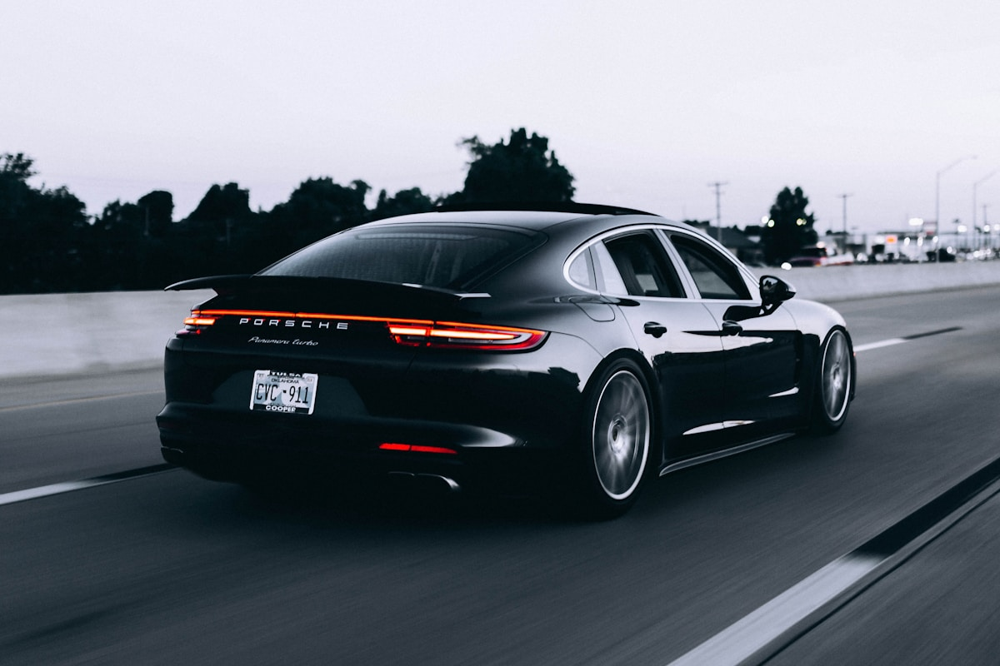

#

{transparency:15,size:1920*1080,}

## Brand Overview

Mercedes-Benz, a division of the Mercedes-Benz Group AG, is one of the world's most prestigious luxury automotive brands. Founded in 1926, the brand is synonymous with **innovation, luxury, safety, and engineering excellence**. Headquartered in Stuttgart, Germany, Mercedes-Benz operates in every major global market.

### Brand Values

- **The Best or Nothing** — Gottlieb Daimler's guiding philosophy
- Pioneer in automotive safety and technology
- Icon of German engineering and craftsmanship
- Leader in sustainable luxury mobility

### Global Presence

- Founded: 1926 (Karl Benz, Gottlieb Daimler)
- Headquarters: Stuttgart, Germany
- Global sales: 2.49 million vehicles (2023)
- Employees: 173,000+ worldwide
- Production in 17 countries

## Vehicle Portfolio

{transparency:0,size:800*500,}

### Luxury Segment

The flagship S-Class represents the pinnacle of automotive luxury, featuring cutting-edge technology and unparalleled comfort. The E-Class and C-Class bring luxury and innovation to executive and mid-size segments.

### Performance & AMG

Mercedes-AMG develops high-performance variants across the lineup, from the compact CLA 45 to the formidable GT 63 S. AMG vehicles combine luxury with motorsport-derived performance.

### Electric Future

The EQ family — including EQS, EQE, EQA, and EQB — represents Mercedes-Benz's commitment to an all-electric future. The brand aims to go **all-electric by 2030** where market conditions allow.

## Technology & Innovation

### MB.OS — Mercedes-Benz Operating System

A proprietary chip-to-cloud architecture that integrates all vehicle domains into a single platform, enabling over-the-air updates, AI-powered personalization, and seamless connectivity.

### DRIVE PILOT

Mercedes-Benz is the **first automaker with internationally certified Level 3** conditional automated driving (SAE Level 3). DRIVE PILOT is available on S-Class and EQS in select markets.

### Safety Leadership

- Invented the crumple zone (1959), ABS (1978), airbag (1981)
- PRE-SAFE anticipatory occupant protection
- Car-to-X communication for hazard warning
- Active Brake Assist with cross-traffic function

## Design Philosophy

### Sensual Purity

Mercedes-Benz design language emphasizes clean surfaces, sculptural forms, and emotional appeal. Each model balances **modern aesthetics with timeless elegance**, creating vehicles that are immediately recognizable on the road.

### Interior Excellence

The interior experience combines premium materials (leather, wood, metal), ambient lighting with 64 colors, and hyperscreen technology spanning the entire dashboard. The focus is on creating a **luxurious, connected sanctuary**.

### Aerodynamics

The EQS holds the record for the **most aerodynamic production car** with a drag coefficient of just Cd 0.20, maximizing electric range and reducing noise.

## Sustainability

Mercedes-Benz is committed to **Ambition 2039** — a comprehensive plan to achieve carbon neutrality across the entire value chain by 2039. This includes:

- CO₂-neutral production at all owned plants
- Battery recycling and circular economy initiatives
- Sustainable supply chain with responsible sourcing
- Renewable energy in manufacturing and charging network

## Summary

Mercedes-Benz is transforming from a traditional luxury automaker into a **tech-driven, sustainable mobility company**. Through its EQ electric lineup, cutting-edge MB.OS platform, Level 3 autonomous driving, and Ambition 2039 sustainability goals, the brand is defining what luxury means for the 21st century.
