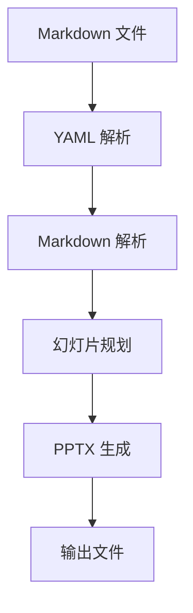

#

<!-- Title page background images -->
{transparency:30,size:1920*1080,}
{transparency:30,size:1920*1080,}

## 项目概述

本项目旨在构建一个可重用的 Markdown 转 PPTX 转换工具，支持公司文档的自动化排版。

### 项目背景

- 日常工作中需要频繁制作 PPT 汇报材料
- 手动排版耗时且风格不统一
- 需要支持公司品牌元素（Logo、配色、页眉页脚）

### 项目目标

- 实现 Markdown 到 PPTX 的自动化转换
- 支持 YAML 元数据配置（公司信息、字体、颜色）
- 支持多列布局和图文混排
- 提供可重用的脚本和模板

### 当前进展

- 已完成需求分析和架构设计
- 数据模型定义完毕
- 解析器和主题管理器已实现
- PPTX 生成器开发中

### 下一步计划

- 完成 PPTX 生成器
- 实现 CLI 入口
- 编写测试用例
- 输出模板示例文档

## 技术架构

{transparency:10,size:800*600,}

### 核心模块

- **解析器（Parser）**：状态机驱动的 Markdown 解析，提取 YAML 元数据
- **主题管理器（Theme）**：管理配色、字体、Logo 等视觉元素
- **幻灯片构建器（Slide Builder）**：布局检测与幻灯片规划
- **PPTX 生成器（Presentation）**：基于 python-pptx 的幻灯片渲染

## 代码示例

以下是一个简单的使用示例：

```python
from parser import parse_document
from theme import Theme
from slide_builder import build_slides
from presentation import PresentationBuilder

# 解析 Markdown 文件
meta, h1_blocks, sections, base_dir = parse_document("input.md")

# 加载主题
theme = Theme(meta)

# 构建幻灯片
slides = build_slides(meta, h1_blocks, sections)

# 生成 PPTX
builder = PresentationBuilder(theme, meta, base_dir)
for slide in slides:
    builder.build_slide(slide)
builder.save("output.pptx")
```

## 系统流程



## 路线图

- **Phase 1**：基础框架与数据模型
- **Phase 2**：解析器实现
- **Phase 3**：幻灯片构建与布局
- **Phase 4**：PPTX 生成与 CLI
- **Phase 5**：测试与文档

## 总结

本工具实现了从 Markdown 到 PPTX 的全自动转换，支持：

- 公司品牌自定义（Logo、配色、字体）
- 多列布局（1/2/3/4 列）
- 图文混排
- 代码块与 Mermaid 图表
- 首页和尾页定制
- 页眉页脚（公司信息 + 页码）
- 批量转换
